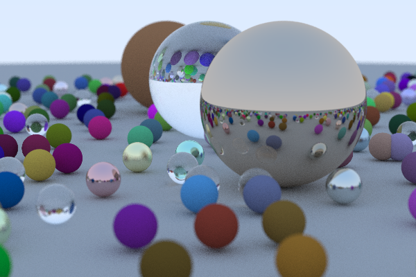

# ray-tracing
An attempt at Ray Tracing in One Weekend (https://raytracing.github.io/books/RayTracingInOneWeekend.html) using beginner Haskell.

    time stack run > finalimage.ppm
    Rendering row 400 of 400
    Done.
    ________________________________________________________
    Executed in   21.52 mins   fish           external
       usr time  1330.13 secs  150.00 micros  1330.13 secs
       sys time   80.66 secs  975.00 micros   80.66 secs

with -O2:

    time stack run > testrandombigger2.ppm
    Rendering row 400 of 400
    Done.
    ________________________________________________________
    Executed in   17.51 mins   fish           external
       usr time  1117.18 secs  142.00 micros  1117.18 secs
       sys time   46.12 secs  780.00 micros   46.12 secs
